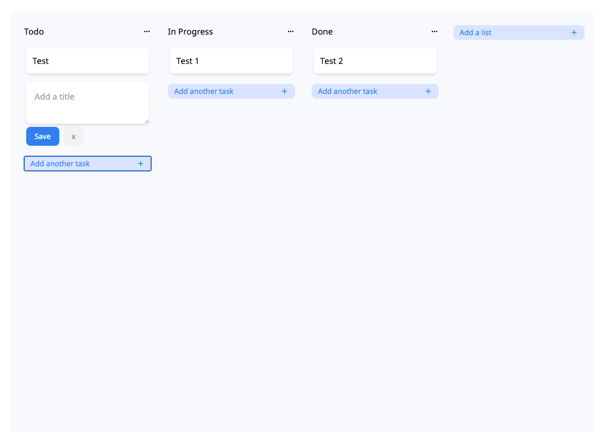

## Hipporello Interview

## Summary

A simple task management interface where Trello like lists and cards can be created and moved between lists.

#### Expected design should be like

## Requirements

- List create, delete and edit,
- Card create, delete and edit at list
- Cards should be able to move from list to another list.
- Cards and lists should not be deleted when the page is refreshed
- Project must be React 
- All state management must be done with Redux

## Notes

You can use; 
- Ui library that you will feel comfortable with
- Any toolkit
